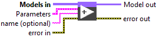
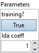
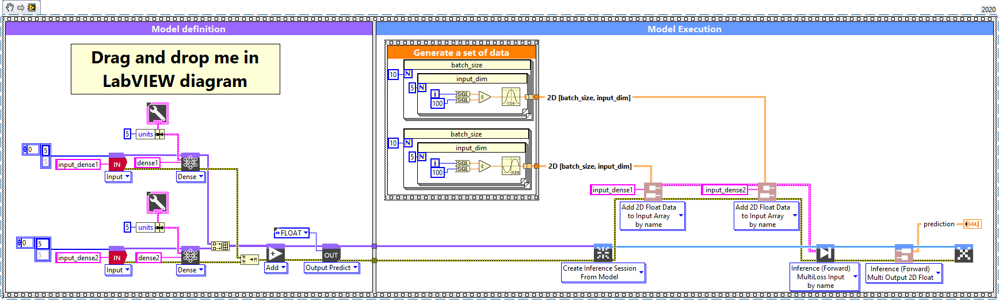

# Add

> 🔹 *Layer Documentation – Deep Learning Toolkit for LabVIEW*

---

## Description

Setup and add the add layer into the model during the definition graph step.  
Type : *polymorphic.*

  

---

## Input parameters

| **Parameters** | **Interface** |
|----------------|----------------|
| ** Models in :** *array*, model architecture.   ** Parameters :** layer parameters.    ** training? :** *boolean*, whether the layer is in training mode (can store data for backward). Default value “True”.    ** lda coeff :** *float*, defines the coefficient by which the loss derivative will be multiplied before being sent to the previous layer (since during the backward run we go backwards). Default value “1”.    ** name (optional) :** *string*, name of the layer. |  |

---

## Output parameters

** Model out :** model architecture.

---

## Dimension

### Input shape
All layers used for add must have same output shape.  
Refer Layer tensor output shape used.

### Output shape
Same as input shape.

---

## Example

All these examples are snippets PNG, you can drop these Snippet onto the block diagram and get the depicted code added to your VI (Do not forget to install Deep Learning library to run it).

---

### Add layer with two identical input layer shape

  

1 – Generate a set of data  

We generate an array of data of type single and shape [batch_size = 10, input_dim = 5] (same input shape).

2 – Define graph  

We first define two input layers named input_dense1 and input_dense2.  
This layers is setup as an input array shaped [input_dim = 5].  
In order to have same output shape for added dense layers we define for both of these the same “units” parameter (units = 5) (refer **Dense** layer add to graph documentation for more details).  
We construct an array of the two graphs generated at the input Add as an interpretation of the Dense1 + Dense2 operation.

3 – Summarize graph  

Returns the summary of the model in file text.

4 – Run graph  

We call the forward method and retrieve the result with the “Prediction 2D” method.  
This method returns two variables, the first one is the layer information (cluster composed of the layer name, the graph index and the shape of the output layer) and the second one is the prediction with a shape of [batch_size, units] (Dense output shape).

---

### Add layer with two different input layer shape

  

1 – Generate a set of data  

We generate two array of data of type single and shape1 [batch_size = 10, input_dim = 5] and shape2 [batch_size = 10, input_dim = 15] (different input shape).

2 – Define graph  

We first define two input layers named input_dense1 and input_dense2.  
This layers is setup as an input array shaped [input_dim = 5] and [input_dim = 15].  
In order to have same output shape for added dense layers we define for both of these the same “units” parameter (units = 5) (refer **Dense** layer add to graph documentation for more details).  
We construct an array of the two graphs generated at the input Add as an interpretation of the Dense1 + Dense2 operation.

3 – Summarize graph  

Returns the summary of the model in file text.

4 – Run graph  

We call the forward method and retrieve the result with the “Prediction 2D” method.  
This method returns two variables, the first one is the layer information (cluster composed of the layer name, the graph index and the shape of the output layer) and the second one is the prediction with a shape of [batch_size, units] (Dense output shape).

---

  <a href="../Layers.md" style="text-decoration:none; font-weight:bold;">⬅️ Back to Layers</a>

