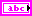

# AdditiveAttention

> 🔹 *Layer Documentation – Deep Learning Toolkit for LabVIEW*

---

## Description

Setup and add the additive attention layer into the model during the definition graph step.  
Type : *polymorphic.*

  

---

## Input parameters

| **Parameters** | **Interface** |
|----------------|----------------|
| ** Models in :** *array*, model architecture. Must be query, value, key (key is optional).   ** Parameters :** layer parameters.    ** use scale :** *boolean*, if True, will create a variable to scale the attention scores. Default value “Trueâ€.    ** training? :** *boolean*, whether the layer is in training mode (can store data for backward). Default value “Trueâ€.    ** store? :** *boolean*, whether the layer stores the last iteration gradient (accessible via the “get_gradients†function). Default value “Falseâ€.    ** update? :** *boolean*, whether the layer’s variables should be updated during backward. Equivalent to freeze the layer. Default value “Trueâ€.    ** lda coeff :** *float*, defines the coefficient by which the loss derivative will be multiplied before being sent to the previous layer (since during the backward run we go backwards). Default value “1â€.    ** name (optional) :** *string*, name of the layer. |  |

---

## Output parameters

** Model out :** model architecture.

---

## Dimension

### Input shape

List of the following tensors:
- **query** : Query *Tensor* of shape [batch_size, Tq, dim].  
- **value** : Value *Tensor* of shape [batch_size, Tv, dim].  
- **key** : Optional key *Tensor* of shape [batch_size, Tv, dim].  
  If not given, will use *value* for both *key* and *value*, which is the most common case.

### Output shape

Attention outputs of shape [batch_size, Tq, dim].

---
## Example

All these examples are snippets PNG, you can drop these Snippet onto the block diagram and get the depicted code added to your VI (Do not forget to install Deep Learning library to run it).

---

### AdditiveAttention layer with two identical input layer shape

  

1 – Generate a set of data  

We generate two array of data of type single and shape [batch_size = 10, Tq & Tv = 7, dim = 10] (same input shape).

2 – Define graph  

We first define two input layers named “query_input” and “value_input”.  
This layers is setup as an input array shaped [Tq = 7, dim = 10] and [Tv = 7, dim = 10].  
Finally, we construct an array of the two graphs generated at the input of AdditiveAttention.

3 – Summarize graph  

Returns the summary of the model in file text.

4 – Run graph  

We call the forward method and retrieve the result with the “Prediction 3D” method.  
This method returns two variables, the first one is the layer information (cluster composed of the layer name, the graph index and the shape of the output layer) and the second one is the prediction with a shape of [batch_size, Tq, dim].

---

### AdditiveAttention layer with two different input layer shape

  

1 – Generate a set of data  

We generate two array of data of type single and shape1 [batch_size = 10, Tq = 4, dim = 10] and shape2 [batch_size = 10, Tv = 7, dim = 10] (different input shape).  
We can only modify the first dimension (Tq or Tv) because the layer won’t accept different dimension between query, value and key.

2 – Define graph  

We first define two input layers named “query_input” and “value_input”.  
This layers is setup as an input array shaped [Tq = 4, dim = 10] and [Tv = 7, dim = 10].  
Finally, we construct an array of the two graphs generated at the input of AdditiveAttention.

3 – Summarize graph  

Returns the summary of the model in file text.

4 – Run graph  

We call the forward method and retrieve the result with the “Prediction 3D” method.  
This method returns two variables, the first one is the layer information (cluster composed of the layer name, the graph index and the shape of the output layer) and the second one is the prediction with a shape of [batch_size, Tq, dim].

---

  <a href="../Layers.md" style="text-decoration:none; font-weight:bold;">⬅️ Back to Layers</a>

