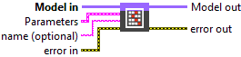
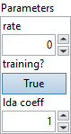
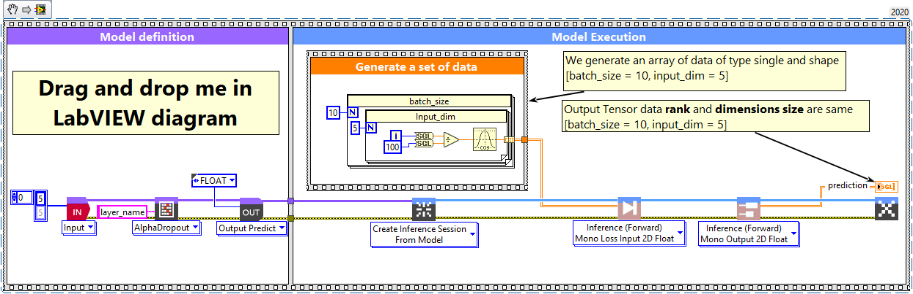
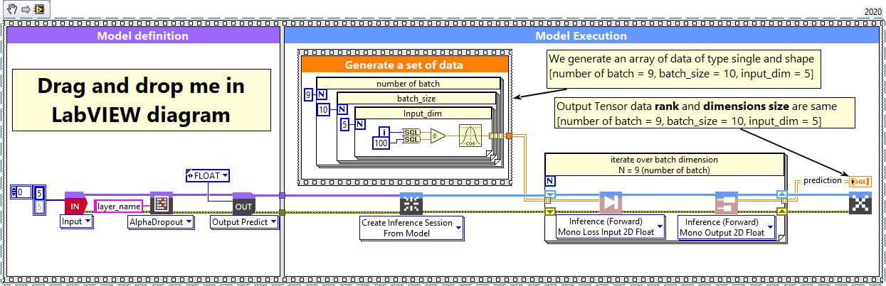

# AlphaDropout

> 🔹 *Layer Documentation – Deep Learning Toolkit for LabVIEW*

---

## Description

Setup and add the alpha dropout layer into the model during the definition graph step.  
Type : *polymorphic.*

  

---

## Input parameters

| **Parameters** | **Interface** |
|----------------|----------------|
| ** Model in :** model architecture.   ** Parameters :** layer parameters.    ** rate :** *float*, drop probability (as with Dropout). The multiplicative noise will have standard deviation sqrt(rate / (1 – rate)). Default value “0”.    ** training? :** *boolean*, whether the layer is in training mode (can store data for backward). Default value “True”.    ** lda coeff :** *float*, defines the coefficient by which the loss derivative will be multiplied before being sent to the previous layer (since during the backward run we go backwards). Default value “1”.    ** name (optional) :** *string*, name of the layer. |  |

---

## Output parameters

** Model out :** model architecture.

---

## Dimension

### Input shape
Input tensor (of any rank).

### Output shape
Same as input shape.

---

## Example

All these examples are snippets PNG, you can drop these Snippet onto the block diagram and get the depicted code added to your VI (Do not forget to install Deep Learning library to run it).

---

### AlphaDropout layer with explicit input layer

  

1 – Generate a set of data  

We generate an array of data of type single and shape [batch_size = 10, input_dim = 5].

2 – Define graph  

First, we define the first layer of the graph which is an Input layer (explicit input layer method).  
This layer is setup as an input array shaped [input_dim = 5].  
Then we add to the graph the AlphaDropout layer.

3 – Run graph  

We call the forward method and retrieve the result with the “Prediction 2D” method.  
This method returns two variables, the first one is the layer information (cluster composed of the layer name, the graph index and the shape of the output layer) and the second one is the prediction with a shape of [batch_size, input_dim].

---

### AlphaDropout layer, batch and dimension

  

1 – Generate a set of data  

We generate an array of data of type single and shape [number of batch = 9, batch_size = 10, input_dim = 5].

2 – Define graph  

First, we define the first layer of the graph which is an Input layer (explicit input layer method).  
This layer is setup as an input array shaped [input_dim = 5].  
Then we add to the graph the AlphaDropout layer.

3 – Run graph  

We call the forward method and retrieve the result with the “Prediction 2D” method.  
This method returns two variables, the first one is the layer information (cluster composed of the layer name, the graph index and the shape of the output layer) and the second one is the prediction with a shape of [batch_size, input_dim].

---

  <a href="../Layers.md" style="text-decoration:none; font-weight:bold;">⬅️ Back to Layers</a>

