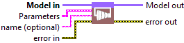
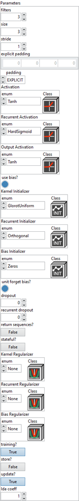
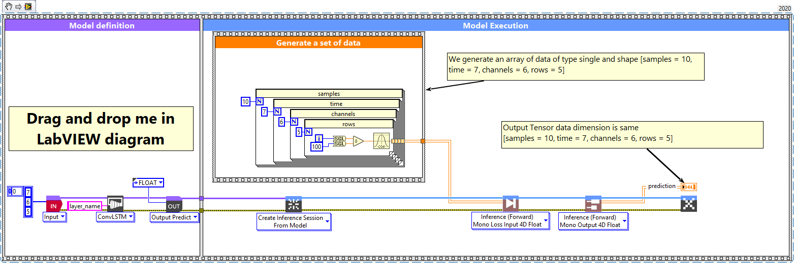
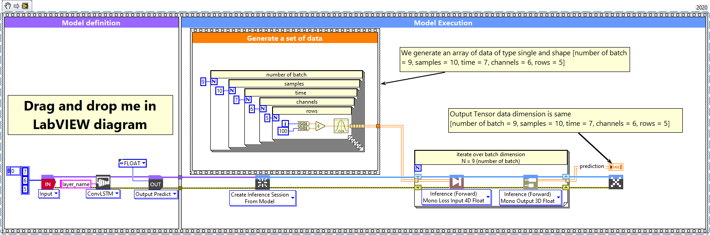

# ConvLSTM1D

> 🔹 *Layer Documentation – Deep Learning Toolkit for LabVIEW*

---

## Description

Setup and add the convolution LSTM 1D layer into the model during the definition graph step.  
Type : *polymorphic.*

  

---

## Input parameters

| **Parameters** | **Interface** |
|----------------|----------------|
| ** Model in :** *model architecture.*   ** Parameters :** layer parameters.    ** filters :** *integer*, the dimensionality of the output space. Default value “3”.    ** size :** *integer*, specify the length of the 1D convolution window. Default value “3”.    ** stride :** *integer*, specify the stride length of the convolution. Default value “1”.    ** explicit padding :** *array*, specifies the number of pixels to pad at the beginning and end of each spatial axis. Batch and channel axes are not padded. Only used when padding = EXPLICIT. Default value “empty”.    ** padding :** *enum*, type of padding to apply. Default value “VALID”.    ** Activation :** *cluster*, applied to the candidate cell input. This function transforms the new information considered for updating the cell state.    ** Recurrent Activation :** *cluster*, applied to the input, forget, and output gates. It controls which parts of the past information are allowed to pass or be blocked.    ** Output Activation :** *cluster*, applied to the updated cell state before producing the visible hidden output of the LSTM at each time step.    ** use bias? :** *boolean*, whether the layer uses a bias vector. Default value “True”.    ** Kernel Initializer :** *cluster*, initializer for the kernel weights matrix, used for the linear transformation of the inputs.    ** Recurrent Initializer :** *cluster*, initializer for the recurrent_kernel weights matrix, used for the linear transformation of the recurrent state.    ** Bias Initializer :** *cluster*, initializer for the bias vector.    ** unit forget bias? :** *boolean*, if True, add 1 to the bias of the forget gate at initialization. Use in combination with Bias Initializer = ‘Zeros’. Default value “True”.    ** dropout :** *float*, between 0 and 1. Fraction of the units to drop for the linear transformation of the inputs.    ** recurrent dropout :** *float*, between 0 and 1. Fraction of the units to drop for the linear transformation of the recurrent state.    ** return sequences? :** *boolean*, whether to return the last output in the output sequence, or the full sequence. Default value “False”.    ** stateful? :** *boolean*, if True, the last state for each sample at index i in a batch will be used as initial state for the sample of index i in the following batch. Default value “False”.    ** Kernel Regularizer :** *cluster*, regularizer function applied to the kernel weights matrix.    ** Recurrent Regularizer :** *cluster*, regularizer function applied to the recurrent_kernel weights matrix.    ** Bias Regularizer :** *cluster*, regularizer function applied to the bias vector.    ** training? :** *boolean*, whether the layer is in training mode (can store data for backward). Default value “True”.    ** store? :** *boolean*, whether the layer stores the last iteration gradient (accessible via the “get_gradients” function). Default value “False”.    ** update? :** *boolean*, whether the layer’s variables should be updated during backward. Equivalent to freeze the layer. Default value “True”.    ** lda coeff :** *float*, defines the coefficient by which the loss derivative will be multiplied before being sent to the previous layer (since during the backward run we go backwards). Default value “1”.    ** name (optional) :** *string*, name of the layer. |  |

---

## Output parameters

** Model out :** model architecture.

---

## Dimension

### Input shape

4D tensor with shape:
- If *data_format* = ‘channels_last’ : *(samples, time, rows, channels)*.  
- If *data_format* = ‘channels_first’ : *(samples, time, channels, rows)*.

### Output shape

If *return_sequences* = True :
- If *data_format* = ‘channels_last’ : 4D tensor with shape *(samples, timesteps, new_rows, filters)*.  
- If *data_format* = ‘channels_first’ : 4D tensor with shape *(samples, timesteps, filters, new_rows)*.

If *return_sequences* = False :
- If *data_format* = ‘channels_last’ : 3D tensor with shape *(samples, new_rows, filters)*.  
- If *data_format* = ‘channels_first’ : 3D tensor with shape *(samples, filters, new_rows)*.

---

## Example

All these examples are snippets PNG, you can drop these Snippet onto the block diagram and get the depicted code added to your VI (Do not forget to install Deep Learning library to run it).

---

### ConvLSTM1D layer

  

1 – Generate a set of data  

We generate an array of data of type single and shape [samples = 10, time = 7, channels = 6, rows = 5].

2 – Define graph  

First, we define the first layer of the graph which is an Input layer (explicit input layer method).  
This layer is setup as an input array shaped [time = 7, channels = 6, rows = 5].  
Then we add to the graph the ConvLSTM1D layer.

3 – Run graph  

We call the forward method and retrieve the result with the “Prediction 3D” method.  
This method returns two variables, the first one is the layer information (cluster composed of the layer name, the graph index and the shape of the output layer) and the second one is the prediction with a shape of [samples, filters, new_rows].  
The output dimension depends on the parameters “return-sequences” refer to the chapter “Dimension” of this documentation.

---

### ConvLSTM1D layer, batch and dimension

  

1 – Generate a set of data  

We generate an array of data of type single and shape [number of batch = 9, samples = 10, time = 7, channels = 6, rows = 5].

2 – Define graph  

First, we define the first layer of the graph which is an Input layer (explicit input layer method).  
This layer is setup as an input array shaped [time = 7, channels = 6, rows = 5].  
Then we add to the graph the ConvLSTM1D layer.

3 – Run graph  

We call the forward method and retrieve the result with the “Prediction 3D” method.  
This method returns two variables, the first one is the layer information (cluster composed of the layer name, the graph index and the shape of the output layer) and the second one is the prediction with a shape of [samples, filters, new_rows].  
The output dimension depends on the parameters “return-sequences” refer to the chapter “Dimension” of this documentation.

---

  <a href="../Layers.md" style="text-decoration:none; font-weight:bold;">⬅️ Back to Layers</a>

