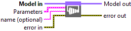
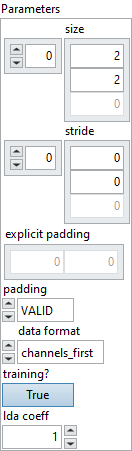
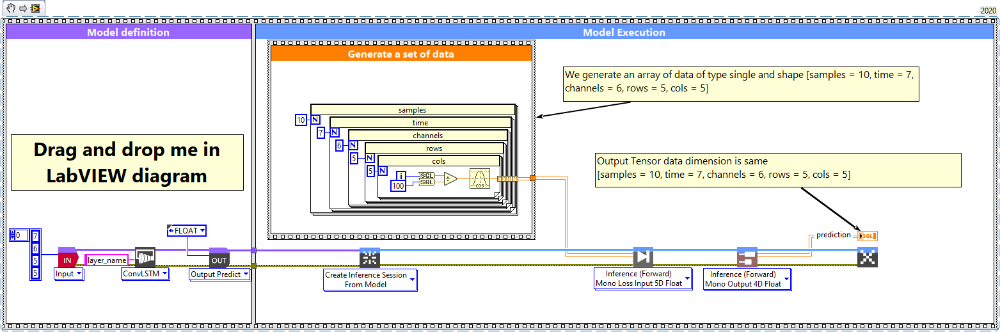
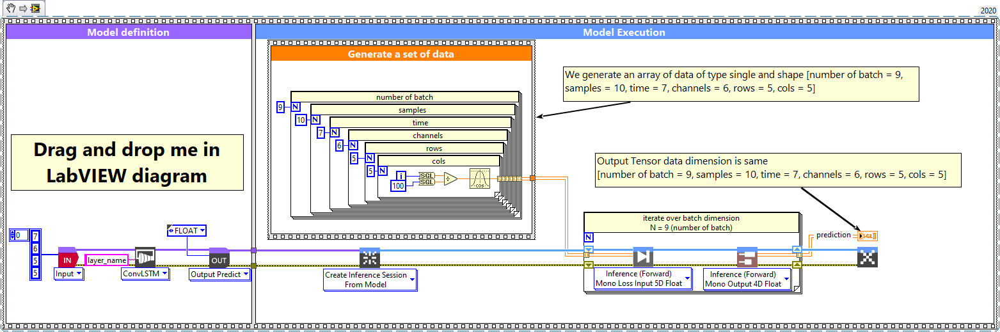

# ConvLSTM2D

> 🔹 *Layer Documentation – Deep Learning Toolkit for LabVIEW*

---

## Description

Setup and add the convolution LSTM 2D layer into the model during the definition graph step.  
Type : *polymorphic.*

  

---

## Input parameters

| **Parameters** | **Interface** |
|----------------|----------------|
| ** Model in :** *model architecture.*   ** Parameters :** layer parameters.    ** filters :** *integer*, the dimensionality of the output space. Default value “1”.    ** size :** *array*, specify the dimensions of the convolution window. Default value “[3,3]”.    ** stride :** *array*, specify the strides of the convolution. Default value “[1,1]”.    ** explicit padding :** *array*, specifies the number of pixels to pad at the beginning and end of each spatial axis. Only used when padding = *EXPLICIT.* Default value “empty”.    ** padding :** *enum*, type of padding to apply. Default value “VALID”.    ** Activation :** *cluster*, applied to the candidate cell input. Transforms new information considered for updating the cell state.    ** Recurrent Activation :** *cluster*, applied to input, forget, and output gates. Controls which parts of past information are allowed to pass or be blocked.    ** Output Activation :** *cluster*, applied to the updated cell state before producing the visible hidden output.    ** use bias? :** *boolean*, whether the layer uses a bias vector. Default value “True”.    ** Kernel Initializer :** *cluster*, initializer for the *kernel* weights matrix. Used for linear transformation of the inputs.    ** Recurrent Initializer :** *cluster*, initializer for the *recurrent_kernel* weights matrix. Used for linear transformation of the recurrent state.    ** Bias Initializer :** *cluster*, initializer for the bias vector.    ** unit forget bias? :** *boolean*, if True, add 1 to the bias of the forget gate at initialization. Use in combination with Bias Initializer = ‘Zeros’. Default value “True”.    ** dropout :** *float*, fraction of the units to drop for the linear transformation of the inputs (0–1).    ** recurrent dropout :** *float*, fraction of the units to drop for the linear transformation of the recurrent state (0–1).    ** return sequences? :** *boolean*, whether to return the last output or the full sequence. Default value “False”.    ** stateful? :** *boolean*, if True, the last state for each sample will be used as initial state for the next batch. Default value “False”.    ** Kernel Regularizer :** *cluster*, regularization function applied to *kernel* weights.    ** Recurrent Regularizer :** *cluster*, regularization function applied to *recurrent_kernel* weights.    ** Bias Regularizer :** *cluster*, regularization function applied to the bias vector.    ** training? :** *boolean*, whether the layer is in training mode (can store data for backward). Default value “True”.    ** store? :** *boolean*, whether the layer stores the last iteration gradient (accessible via “get_gradients”). Default value “False”.    ** update? :** *boolean*, whether the layer’s variables should be updated during backward (freeze layer if False). Default value “True”.    ** lda coeff :** *float*, defines the coefficient by which the loss derivative will be multiplied before being sent to the previous layer. Default value “1”.    ** name (optional) :** *string*, name of the layer. |  |

---

## Output parameters

** Model out :** model architecture.

---

## Dimension

### Input shape

5D tensor with shape:
- If `data_format = 'channels_last'` : (samples, time, rows, cols, channels)  
- If `data_format = 'channels_first'` : (samples, time, channels, rows, cols)

### Output shape

- If `return_sequences = True` :  
  - `channels_last` → 5D tensor with shape (samples, timesteps, new_rows, new_cols, filters)  
  - `channels_first` → 5D tensor with shape (samples, timesteps, filters, new_rows, new_cols)

- If `return_sequences = False` :  
  - `channels_last` → 4D tensor with shape (samples, new_rows, new_cols, filters)  
  - `channels_first` → 4D tensor with shape (samples, filters, new_rows, new_cols)

---

## Example

All these examples are snippets PNG, you can drop these Snippet onto the block diagram and get the depicted code added to your VI (Do not forget to install Deep Learning library to run it).

---

### ConvLSTM2D layer

  

1 – Generate a set of data  
We generate an array of data of type single and shape [samples = 10, time = 7, channels = 6, rows = 5, cols = 5].

2 – Define graph  
First, we define the first layer of the graph which is an Input layer (explicit input layer method).  
This layer is setup as an input array shaped [time = 7, channels = 6, rows = 5, cols = 5].  
Then we add to the graph the ConvLSTM2D layer.

3 – Run graph  
We call the forward method and retrieve the result with the “Prediction 4D” method.  
This method returns two variables:
- the layer information (name, graph index, and shape of the output layer)
- the prediction with shape [samples, filters, new_rows, new_cols].  

The output dimension depends on the parameter `return_sequences`; see the “Dimension” chapter.

---

### ConvLSTM2D layer, batch and dimension

  

1 – Generate a set of data  
We generate an array of data of type single and shape [number of batch = 9, samples = 10, time = 7, channels = 6, rows = 5, cols = 5].

2 – Define graph  
We define the first layer of the graph as an Input layer with shape [time = 7, channels = 6, rows = 5, cols = 5].  
Then we add to the graph the ConvLSTM2D layer.

3 – Run graph  
We call the forward method and retrieve the result with the “Prediction 4D” method.  
This method returns:
- the layer information (cluster with layer name, graph index, and shape)
- the prediction with shape [samples, filters, new_rows, new_cols].  
The output dimension again depends on the parameter `return_sequences`.

---

  <a href="../Layers.md" style="text-decoration:none; font-weight:bold;">⬅️ Back to Layers</a>

