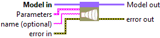
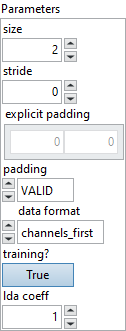
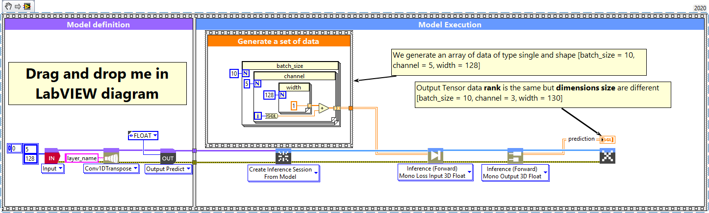
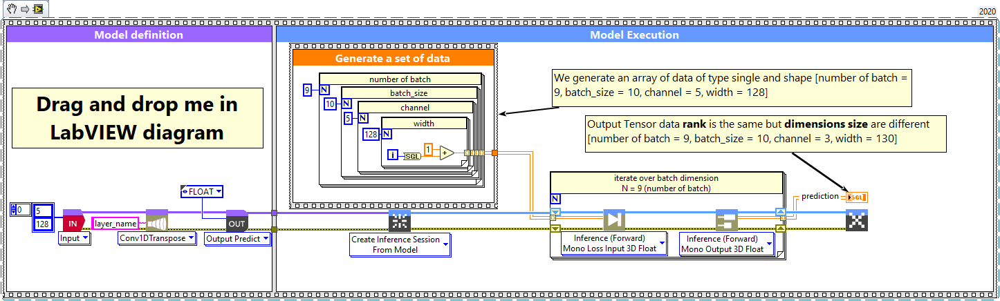

# Convolution 1D Transpose

> 🔹 *Layer Documentation – Deep Learning Toolkit for LabVIEW*

---

## Description

Setup and add the convolution 1D transpose layer into the model during the definition graph step.  
Type : *polymorphic.*

  

---

## Input parameters

| **Parameters** | **Interface** |
|----------------|----------------|
| ** Model in :** *model architecture.*   ** Parameters :** layer parameters.    ** filters :** *integer*, the dimensionality of the output space. Default value “3”.    ** size :** *integer*, specify the length of the 1D convolution window. Default value “3”.    ** stride :** *integer*, specify the stride length of the convolution. Default value “1”.    ** dilation rate :** *integer*, specifying the dilation rate to use for dilated convolution. Default value “1”.    ** explicit padding :** *array*, specifies the number of pixels to pad at the beginning and end of each spatial axis. Batch and channel axes are not padded. Only used when padding = EXPLICIT. Default value “empty”.    ** Activation :** *cluster*, activation function to use.    ** use bias? :** *boolean*, whether the layer uses a bias vector. Default value “True”.    ** padding :** *enum*, type of padding to apply. Default value “VALID”.    ** data format :** *enum*, one of *channels_last* or *channels_first* (default). The ordering of the dimensions in the inputs. *channels_last* corresponds to inputs with shape (batch, steps, features) while *channels_first* corresponds to inputs with shape (batch, features, steps). Default value “channels_first”.    ** Filter Initializer :** *cluster*, initializer for the convolution kernel.   ** Bias Initializer :** *cluster*, initializer for the bias vector.   ** Filter Regularizer :** *cluster*, optional regularizer for the convolution kernel.   ** Bias Regularizer :** *cluster*, optional regularizer for the bias vector.    ** training? :** *boolean*, whether the layer is in training mode (can store data for backward). Default value “True”.    ** store? :** *boolean*, whether the layer stores the last iteration gradient (accessible via the “get_gradients” function). Default value “False”.    ** update? :** *boolean*, whether the layer’s variables should be updated during backward. Equivalent to freeze the layer. Default value “True”.    ** lda coeff : float**, defines the coefficient by which the loss derivative will be multiplied before being sent to the previous layer (since during the backward run we go backwards). Default value “1”.    ** name (optional) :** *string*, name of the layer. |  |

---

## Output parameters

** Model out :** model architecture.

---

## Dimension

### Input shape
3-Dimension tensor with shape : [batch_size, channel, width] (default “channel_first” parameters).  
In case of “channel_last” setup, forward function will input shape [batch_size, width, channels].

### Output shape
Same shape as input 3-Dimension tensor with shape : [batch_size, channel, width] (default “channel_first” parameters).  
In case of “channel_last” setup, forward function will output shape [batch_size, width, channel].

---

## Example

All these examples are snippets PNG — you can drop these Snippets onto the block diagram and get the depicted code added to your VI (Do not forget to install Deep Learning library to run it).

---

### Convolution 1D Transpose layer

  

1 – Generate a set of data  

We generate an array of data of type single and shape [batch_size = 10, channel = 5, width = 128] (channel_first default configuration).  
In case of channel_last layer configuration, shape is [batch_size, width, channel].

2 – Define graph  

First, we define the first layer of the graph which is an Input layer (explicit input layer method).  
This layer is setup as an input array shaped [channel = 5, width = 128].  
Then we add to the graph the Conv1DTranspose layer.

3 – Run graph  

We call the forward method and retrieve the result with the “Prediction 3D” method.  
This method returns two variables:  
- The first one is the layer information (cluster composed of the layer name, the graph index and the shape of the output layer).  
- The second one is the prediction with a shape of [batch_size, filter, new_width].

---

### Convolution 1D Transpose layer – Batch and dimension

  

1 – Generate a set of data  

We generate an array of data of type single and shape [number of batch = 9, batch_size = 10, channel = 5, width = 128] (channel_first default configuration).  
In case of channel_last configuration, shape is [batch_size, width, channel].

2 – Define graph  

We define the first layer of the graph which is an Input layer (explicit input layer method).  
This layer is setup as [channel = 5, width = 128].  
Then we add to the graph the Conv1DTranspose layer.

3 – Run graph  

We call the forward method and retrieve the result with the “Prediction 3D” method.  
This method returns two variables:  
- The first one is the layer information (cluster with layer name, graph index and output shape).  
- The second one is the prediction with a shape [batch_size, filter, new_width].

---

  <a href="../Layers.md" style="text-decoration:none; font-weight:bold;">⬅️ Back to Layers</a>

