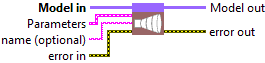
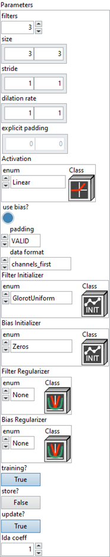
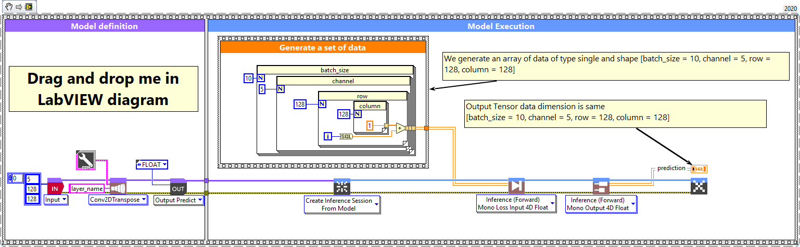
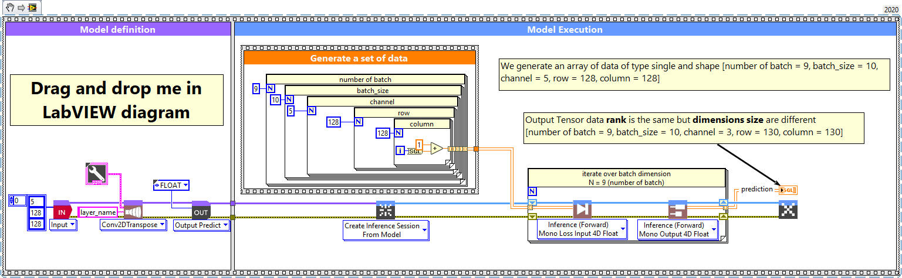

# Convolution 2D Transpose

> 🔹 *Layer Documentation – Deep Learning Toolkit for LabVIEW*

---

## Description

Setup and add the convolution 2D transpose layer into the model during the definition graph step.  
Type : *polymorphic.*

  

---

## Input parameters

| **Parameters** | **Interface** |
|----------------|----------------|
| ** Model in :** *model architecture.*   ** Parameters :** layer parameters.    ** filters :** *integer*, dimensionality of the output space. Default value “3”.    ** size :** *array integer*, specify the height and width of the 2D convolution window. Can be a single integer to specify the same value for all spatial dimensions. Default value “[3,3]”. *Never more 2 values.*    ** stride :** *array integer*, specify the strides of the convolution along the height and width. Can be a single integer to specify the same value for all spatial dimensions. Default value “[1,1]”. *Never more 2 values.*    ** dilation rate :** *integer*, specifying the dilation rate to use for dilated convolution. Default value “[1,1]”. *Never more 2 values.*    ** explicit padding :** *array*, number of pixels to pad at the beginning and end of each spatial axis. Used only when padding = EXPLICIT. Default value “empty”.    ** Activation :** *cluster*, activation function to use.    ** use bias? :** *boolean*, whether the layer uses a bias vector. Default value “True”.    ** padding :** *enum*, type of padding to apply. Default value “VALID”.    ** data format :** *enum*, one of *channels_last* or *channels_first* (default). The ordering of the dimensions in the inputs. *channel_last* corresponds to (batch, steps, features), *channels_first* corresponds to (batch, features, steps). Default value “channels_first”.    ** Filter Initializer :** *cluster*, initializer for the convolution kernel.   ** Bias Initializer :** *cluster*, initializer for the bias vector.   ** Filter Regularizer :** *cluster*, optional regularizer for the convolution kernel.   ** Bias Regularizer :** *cluster*, optional regularizer for the bias vector.    ** training? :** *boolean*, whether the layer is in training mode (can store data for backward). Default value “True”.    ** store? :** *boolean*, whether the layer stores the last iteration gradient (accessible via “get_gradients”). Default value “False”.    ** update? :** *boolean*, whether the layer’s variables should be updated during backward. Equivalent to freezing the layer. Default value “True”.    ** lda coeff :** *float*, coefficient by which the loss derivative will be multiplied before being sent to the previous layer (during backward run). Default value “1”.    ** name (optional) :** *string*, name of the layer. |  |

---

## Output parameters

** Model out :** model architecture.

---

## Dimension

### Input shape
4-D tensor with shape : [batch_size, channel, row, column] (default “channel_first”).  
In case of “channel_last”, forward function will input shape [batch_size, row, column, channel].

### Output shape
Same as input 4-D tensor with shape [batch_size, channel, row, column] (default “channel_first”).  
In case of “channel_last”, forward function will input shape [batch_size, row, column, channel].

---

## Example

All these examples are snippets PNG. You can drop these snippets onto the block diagram and get the depicted code added to your VI (Do not forget to install the Deep Learning library to run it).

---

### Convolution 2D Transpose layer

  

1 – Generate a set of data  

We generate an array of data of type single and shape [batch_size = 10, channel = 5, row = 128, column = 128] (channel_first is default configuration).  
In case of channel_last layer, shape is [batch_size, row, column, channel].

2 – Define graph  

First, we define the first layer of the graph which is an Input layer (explicit input layer method).  
This layer is setup as an input array shaped [channel = 5, row = 128, column = 128].  
Then we add to the graph the Conv2DTranspose layer.

3 – Run graph  

We call the forward method and retrieve the result with the “Prediction 4D” method.  
This method returns two variables:  
- the first one is the layer information (cluster containing the layer name, graph index and output shape)  
- the second is the prediction with shape [batch_size, filter, new_row, new_column].

---

### Convolution 2D Transpose layer – batch and dimension

  

1 – Generate a set of data  

We generate an array of data of type single and shape [number of batch = 9, batch_size = 10, channel = 5, row = 128, column = 128] (channel_first default layer configuration).  
In case of channel_last configuration, shape is [batch_size, row, column, channel].  

2 – Define graph  

First, we define the first layer of the graph which is an Input layer (explicit input method).  
This layer is setup as an input array shaped [channel = 5, row = 128, column = 128].  
Then we add to the graph the Conv2DTranspose layer.  

3 – Run graph  

We call the forward method and retrieve the result with the “Prediction 4D” method.  
This method returns two variables:  
- the first one is the layer information (cluster composed of the layer name, graph index, and output shape),  
- the second is the prediction with shape [batch_size, filter, new_row, new_column].

---

  <a href="../Layers.md" style="text-decoration:none; font-weight:bold;">⬅️ Back to Layers</a>

