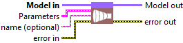
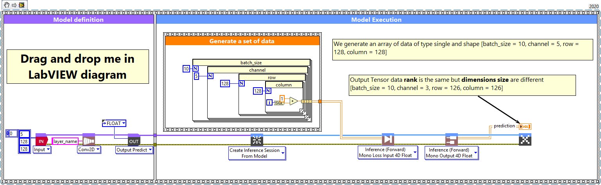
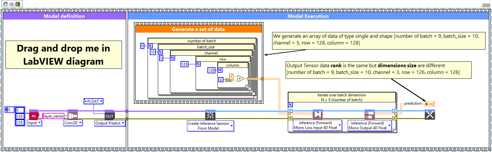

# Convolution 2D

> 🔹 *Layer Documentation – Deep Learning Toolkit for LabVIEW*

---

## Description

Setup and add the convolution 2D layer into the model during the definition graph step.  
Type : *polymorphic.*

  

---

## Input parameters

| **Parameters** | **Interface** |
|----------------|----------------|
| ** Model in :** *model architecture.*   ** Parameters :** layer parameters.    ** filters :** *integer*, the dimensionality of the output space. Default value “3â€.    ** size :** *array integer*, specify the height and width of the 2D convolution window. Can be a single integer to specify the same value for all spatial dimensions. Default value “[3,3]â€. *Never more 2 values.*    ** stride :** *array integer*, specify the strides of the convolution along the height and width. Can be a single integer to specify the same value for all spatial dimensions. Default value “[1,1]â€. *Never more 2 values.*    ** dilation rate :** *integer*, specifying the dilation rate to use for dilated convolution. Default value “[1,1]â€. *Never more 2 values.*    ** explicit padding :** *array*, specifies the number of pixels to pad at the beginning and end of each spatial axis. Batch and channel axes are not padded. Only used when padding = EXPLICIT. Default value “emptyâ€.    ** Activation :** *cluster*, activation function to use. Default value “Linearâ€.    ** use bias? :** *boolean*, whether the layer uses a bias vector. Default value “Trueâ€.    ** padding :** *enum*, type of padding to apply. Default value “VALIDâ€.    ** data format :** *enum*, one of *channels_last* or *channels_first* (default). The ordering of the dimensions in the inputs.  *channels_last* corresponds to inputs with shape *(batch, steps, features)* while *channels_first* corresponds to *(batch, features, steps)*. Default value “channels_firstâ€.    ** Filter Initializer :** *cluster*, initializer for the convolution kernel.   ** Bias Initializer :** *cluster*, initializer for the bias vector.   ** Filter Regularizer :** *cluster*, optional regularizer for the convolution kernel.   ** Bias Regularizer :** *cluster*, optional regularizer for the bias vector.    ** training? :** *boolean*, whether the layer is in training mode (can store data for backward). Default value “Trueâ€.    ** store? :** *boolean*, whether the layer stores the last iteration gradient (accessible via the “get_gradients†function). Default value “Falseâ€.    ** update? :** *boolean*, whether the layer’s variables should be updated during backward. Equivalent to freeze the layer. Default value “Trueâ€.    ** lda coeff :** *float*, defines the coefficient by which the loss derivative will be multiplied before being sent to the previous layer (since during the backward run we go backwards). Default value “1â€.    ** name (optional) :** *string*, name of the layer. |  |

---

## Output parameters

** Model out :** model architecture.

---

## Dimension

### Input shape

4-Dimension tensor with shape : [batch_size, channel, row, column] *(default “channel_first” parameters).*  
In case of “channel_last” setup, forward function will input shape [batch_size, row, column, channel].

### Output shape

Same as input 4-Dimension tensor with shape : [batch_size, channel, row, column] *(default “channel_first” parameters).*  
In case of “channel_last” setup, forward function will input shape [batch_size, row, column, channel].

---

## Example

All these examples are snippets PNG, you can drop these Snippet onto the block diagram and get the depicted code added to your VI (Do not forget to install Deep Learning library to run it).

---

### Convolution 2D layer

  

1 – Generate a set of data  

We generate an array of data of type single and shape [batch_size = 10, channel = 5, row = 128, column = 128] *(channel first is default layer configuration).*  
In case of channel last layer configuration, shape is [batch_size, row, column, channel].

2 – Define graph  

First, we define the first layer of the graph which is an Input layer (explicit input layer method).  
This layer is setup as an input array shaped [channel = 5, row = 128, column = 128].  
Then we add to the graph the Conv2D layer.

3 – Run graph  

We call the forward method and retrieve the result with the “Prediction 4D” method.  
This method returns two variables, the first one is the layer information (cluster composed of the layer name, the graph index and the shape of the output layer) and the second one is the prediction with a shape of [batch_size, filter, new_row, new_column].

---

### Convolution 2D layer, batch and dimension

  

1 – Generate a set of data  

We generate an array of data of type single and shape [number of batch = 9, batch_size = 10, channel = 5, row = 128, column = 128] *(channel first default layer configuration).*  
In case of channel last layer configuration, shape is [batch_size, row, column, channel].

2 – Define graph  

First, we define the first layer of the graph which is an Input layer (explicit input layer method).  
This layer is setup as an input array shaped [channel = 5, row = 128, column = 128].  
Then we add to the graph the Conv2D layer.

3 – Run graph  

We call the forward method and retrieve the result with the “Prediction 4D” method.  
This method returns two variables, the first one is the layer information (cluster composed of the layer name, the graph index and the shape of the output layer) and the second one is the prediction with a shape of [batch_size, filter, new_row, new_column].

---

  <a href="../Layers.md" style="text-decoration:none; font-weight:bold;">⬅️ Back to Layers</a>

