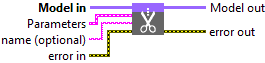
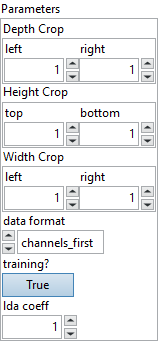
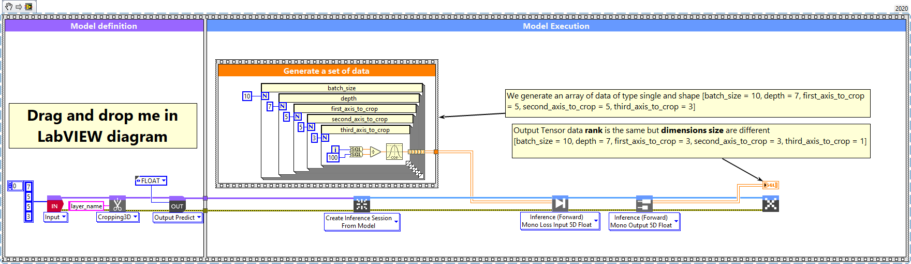
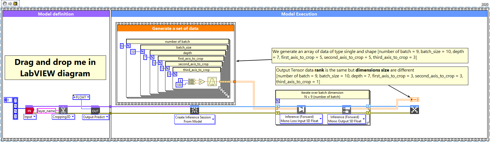

# Cropping3D

> 🔹 *Layer Documentation – Deep Learning Toolkit for LabVIEW*

---

## Description

Setup and add the cropping 3D layer into the model during the definition graph step.  
Type : *polymorphic.*

  

---

## Input parameters

| **Parameters** | **Interface** |
|----------------|----------------|
| ** Model in :** *model architecture.*   ** Parameters :** layer parameters.    ** Depth Crop :** *cluster*, interpreted as *(left, right).* Default value “(1,1)”.    ** Height Crop :** *cluster*, interpreted as two different symmetric cropping values for height and width *(top, bottom).* Default value “(1,1)”.    ** Width Crop :** *cluster*, how many units should be trimmed off at the beginning and end of the cropping dimension *(left, right).* Default value “(1,1)”.    ** data format :** *enum*, one of *channels_last* or *channels_first* (default). The ordering of the dimensions in the inputs. **channels_last** corresponds to inputs with shape *(batch, depth, rows, cols, channels)*, while **channels_first** corresponds to *(batch, channels, depth, rows, cols).* Default value “channels_first”.    ** training? :** *boolean*, whether the layer is in training mode (can store data for backward). Default value “True”.    ** lda coeff :** *float*, defines the coefficient by which the loss derivative will be multiplied before being sent to the previous layer (since during the backward run we go backwards). Default value “1”.    ** name (optional) :** *string*, name of the layer. |  |

---

## Output parameters

** Model out :** model architecture.

---

## Dimension

### Input shape

5D tensor with shape :  
- If `data_format = 'channels_last'` : *(batch_size, first_axis_to_crop, second_axis_to_crop, third_axis_to_crop, depth)*  
- If `data_format = 'channels_first'` : *(batch_size, depth, first_axis_to_crop, second_axis_to_crop, third_axis_to_crop)*

### Output shape

5D tensor with shape :  
- If `data_format = 'channels_last'` : *(batch_size, first_cropped_axis, second_cropped_axis, third_cropped_axis, depth)*  
- If `data_format = 'channels_first'` : *(batch_size, depth, first_cropped_axis, second_cropped_axis, third_cropped_axis)*

---

## Example

All these examples are snippets PNG, you can drop these Snippet onto the block diagram and get the depicted code added to your VI (Do not forget to install Deep Learning library to run it).

---

### Cropping3D layer

  

1 – Generate a set of data  

We generate an array of data of type single and shape [batch_size = 10, depth = 7, first_axis_to_crop = 5, second_axis_to_crop = 5, third_axis_to_crop = 3].

2 – Define graph  

First, we define the first layer of the graph which is an Input layer (explicit input layer method).  
This layer is setup as an input array shaped [depth = 7, first_axis_to_crop = 5, second_axis_to_crop = 5, third_axis_to_crop = 3].  
Then we add to the graph the Cropping3D layer.

3 – Run graph  

We call the forward method and retrieve the result with the “Prediction 5D” method.  
This method returns two variables:  
- the first one is the layer information (cluster composed of the layer name, the graph index and the shape of the output layer),  
- the second one is the prediction with a shape of [batch_size, depth, first_cropped_axis, second_cropped_axis, third_cropped_axis].

---

### Cropping3D layer, batch and dimension

  

1 – Generate a set of data  

We generate an array of data of type single and shape [number of batch = 9, batch_size = 10, depth = 7, first_axis_to_crop = 5, second_axis_to_crop = 5, third_axis_to_crop = 3].

2 – Define graph  

First, we define the first layer of the graph which is an Input layer (explicit input layer method).  
This layer is setup as an input array shaped [depth = 7, first_axis_to_crop = 5, second_axis_to_crop = 5, third_axis_to_crop = 3].  
Then we add to the graph the Cropping3D layer.

3 – Run graph  

We call the forward method and retrieve the result with the “Prediction 5D” method.  
This method returns two variables:  
- the first one is the layer information (cluster composed of the layer name, the graph index and the shape of the output layer),  
- the second one is the prediction with a shape of [batch_size, depth, first_cropped_axis, second_cropped_axis, third_cropped_axis].

---

  <a href="../Layers.md" style="text-decoration:none; font-weight:bold;">⬅️ Back to Layers</a>

