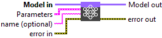
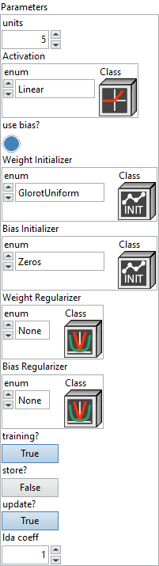
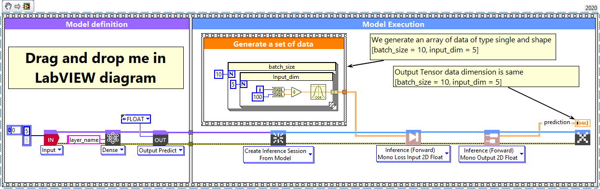
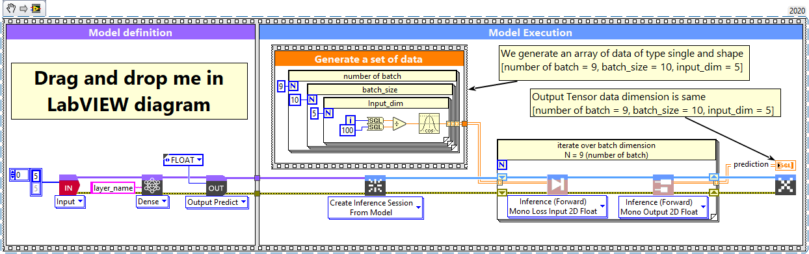
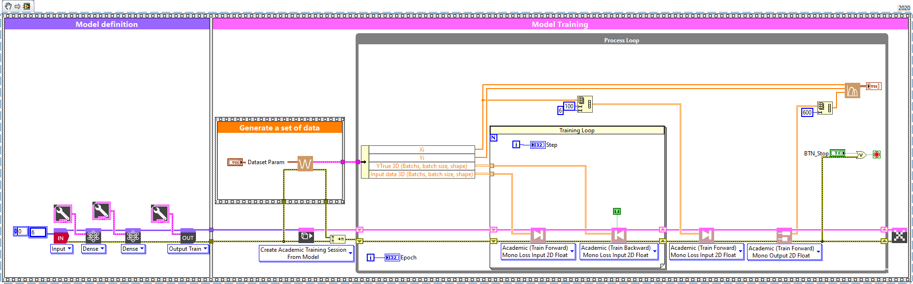
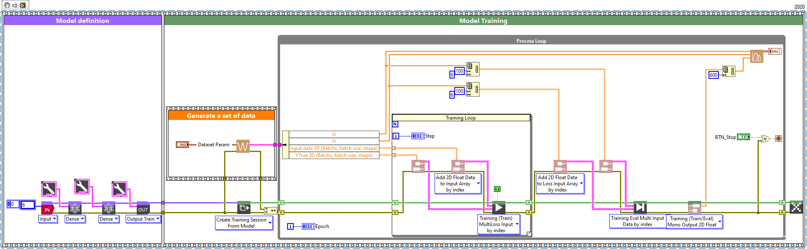

# Dense Layer

> 🔹 *Layer Documentation – Deep Learning Toolkit for LabVIEW*

---

## Description

Setup and add the dense layer into the model during the definition graph step.  
Type : *polymorphic.*

  

---

## Input parameters

| **Parameters** | **Interface** |
|----------------|----------------|
| ** Model in :** *model architecture.*   ** Parameters :** layer parameters.    ** units :** *integer*, dimensionality of the output space.    ** Activation :** *cluster*, activation function to use.    ** use bias? :** *boolean*, whether the layer uses a bias vector. Default value “True”.    ** Weight Initializer :** *cluster*, initializer for the kernel weights matrix.    ** Bias Initializer :** *cluster*, initializer for the bias vector.    ** Weight Regularizer :** *cluster*, regularizer function applied to the kernel weights matrix.    ** Bias Regularizer :** *cluster*, regularizer function applied to the bias vector.    ** training? :** *boolean*, whether the layer is in training mode (can store data for backward). Default value “True”.    ** store? :** *boolean*, whether the layer stores the last iteration gradient (accessible via the “get_gradients” function). Default value “False”.    ** update? :** *boolean*, whether the layer’s variables should be updated during backward. Equivalent to freeze the layer. Default value “True”.    ** lda coeff :** *float*, defines the coefficient by which the loss derivative will be multiplied before being sent to the previous layer (since during the backward run we go backwards). Default value “1”.    ** name (optional) :** *string*, name of the layer. |  |

---

## Output parameters

** Model out :** model architecture.

---

## Dimension

### Input shape

N-Dimension tensor with shape: [batch size, input_dim1, …, input_dimN].  
The most common situation would be a 2D input with shape [batch size, input_dim].  
(input_dim 1 = Input dimension).

### Output shape

N-Dimension tensor with shape: [batch size, units1, …, unitsN].  
For instance, for a 2D input with shape [batch size, input_dim], the output would have shape [batch size, units].

---

## Example

All these examples are snippets PNG, you can drop these Snippet onto the block diagram and get the depicted code added to your VI (Do not forget to install Deep Learning library to run it).

---

### Dense layer

  

1 – Generate a set of data  

We generate an array of data of type single and shape [batch_size = 10, input_dim = 5].

2 – Define graph  

First, we define the first layer of the graph which is an Input layer (explicit input layer method).  
This layer is setup as an input array shaped [input_dim = 5].  
Then we add to the graph the Dense layer.

3 – Run graph  

We call the forward method and retrieve the result with the “Prediction 2D” method.  
This method returns two variables, the first one is the layer information (cluster composed of the layer name, the graph index and the shape of the output layer) and the second one is the prediction with a shape of [batch_size, units].

---

### Dense layer, batch and dimension

  

1 – Generate a set of data  

We generate an array of data of type single and shape [number of batch = 9, batch_size = 10, input_dim = 5].

2 – Define graph  

First, we define the first layer of the graph which is an Input layer (explicit input layer method).  
This layer is setup as an input array shaped [input_dim = 5].  
Then we add to the graph the Dense layer.

3 – Run graph  

We call the forward method and retrieve the result with the “Prediction 2D” method.  
This method returns two variables, the first one is the layer information (cluster composed of the layer name, the graph index and the shape of the output layer) and the second one is the prediction with a shape of [batch_size, units].

---

### (Expert) Academic train model with dense layers (2D)

  

---

### (Expert) Train model with dense layers (2D)

  

---

  <a href="../Layers.md" style="text-decoration:none; font-weight:bold;">⬅️ Back to Layers</a>

