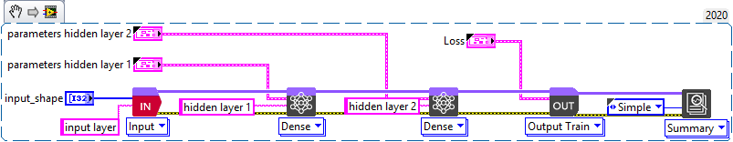
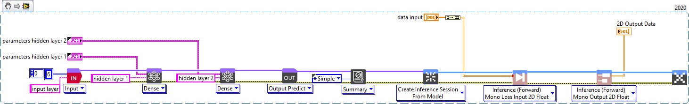
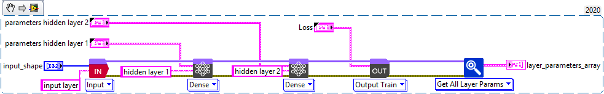
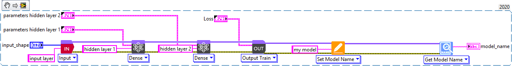
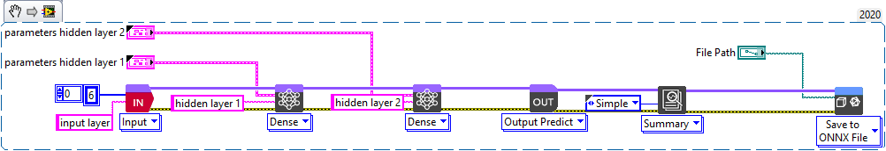

# 🧩 Beginner’s Guide

## 📘 How a model works?

This section provides a quick guide to understand the model design system of the Deep Learning Toolkit for LabVIEW.

---

## 🧱 How to design a model?

This section provides a quick guide showing how to design a model using the LabVIEW Deep Learning Toolkit.

### Basic model design guide
Let’s start by designing a simple model.

| Video | Code used for this video |
|:--:|:--:|
|  | You can drop this snippet onto the block diagram and get the depicted code added to your VI (don’t forget to install the Deep Learning library before).   |

---

## 🧾 How to summarize a model?

This section provides a quick guide showing how to summarize a model within the LabVIEW Deep Learning Toolkit.

| Video | Code used for this video |
|:--:|:--:|
|  | You can drop this snippet onto the block diagram and get the depicted code added to your VI.   |

---

## 📊 How to review and edit the parameters of a model?

This section explains how to get and edit parameters from a model.

| Video | Code used for this video |
|:--:|:--:|
|  | You can drop this snippet onto the block diagram and get the depicted code added to your VI.   |

---

## 🛠️ Set Model Parameters

This section explains how to set or edit parameters of a model.

| Video | Code used for this video |
|:--:|:--:|
|  | Drop this snippet onto the block diagram to reproduce the code.   |

---

## ⚙️ How to run a model?

This section explains how to run a model in LabVIEW.

| Video | Code used for this video |
|:--:|:--:|
|  | Copy this snippet onto your block diagram to run your model.   |

---

## 💾 File Management

This section explains how to **load and save models** in the compatible ONNX format.

### How to save a model?

| Video | Code used for this video |
|:--:|:--:|
|  | Drop this snippet to save your trained model.   |

### How to load a model?

| Video | Code used for this video |
|:--:|:--:|
|  | Drop this snippet to load an ONNX file.   |

---

## 🔄 How to import a Keras / TensorFlow model?

| Video | Description |
|:--:|:--:|
|  | Learn how to import **Keras** or **TensorFlow** models into the LabVIEW Deep Learning Toolkit. |

---

## 🧠 How to fit a model? *(next release)*

This section explains how to fit a model.  
**Fit** is the simplest way to train a model (fully automated) but with more limited control and customization options.  

---

**Tags:** LabVIEW · Deep Learning · Model Design · Training · Inference  

© 2025 Graiphic — Licensed under CC BY 4.0
