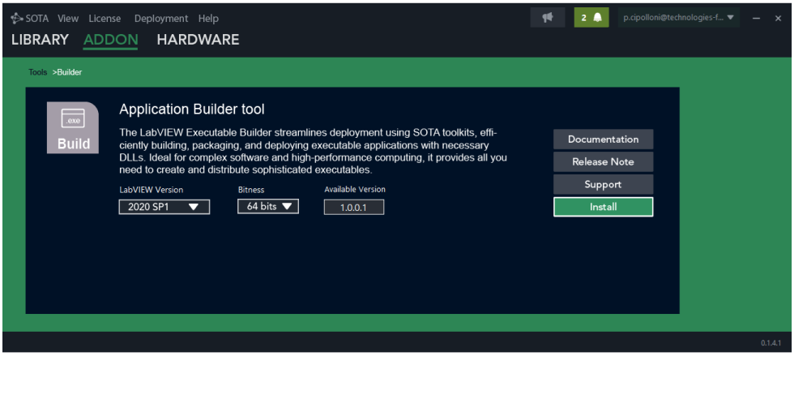
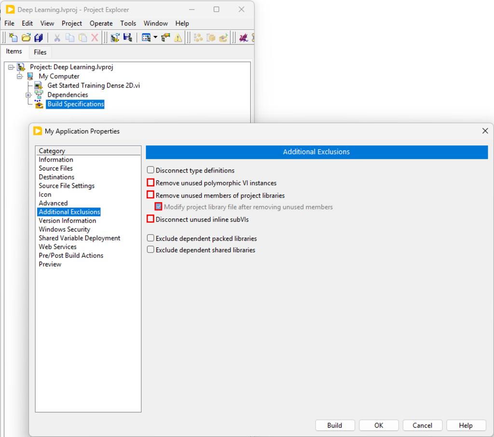
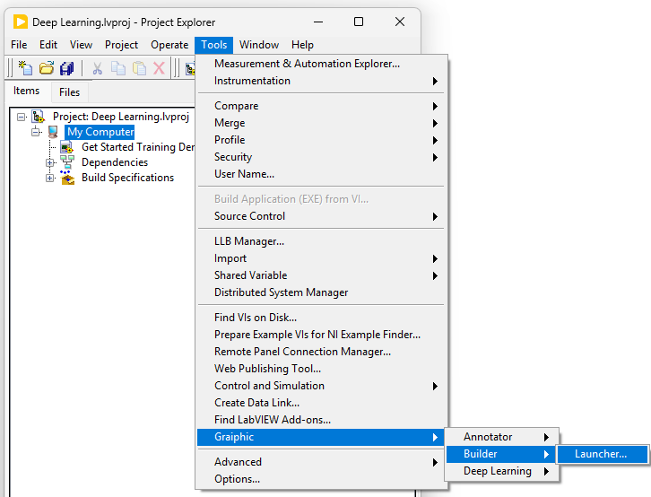
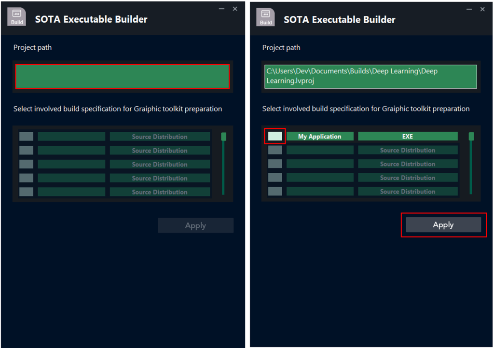
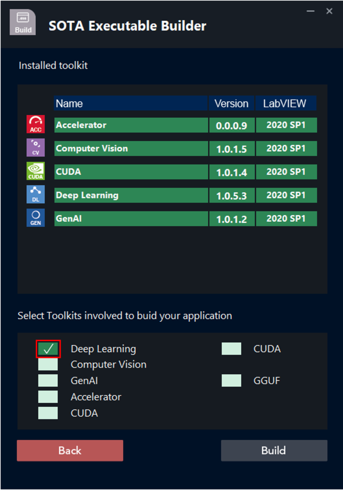
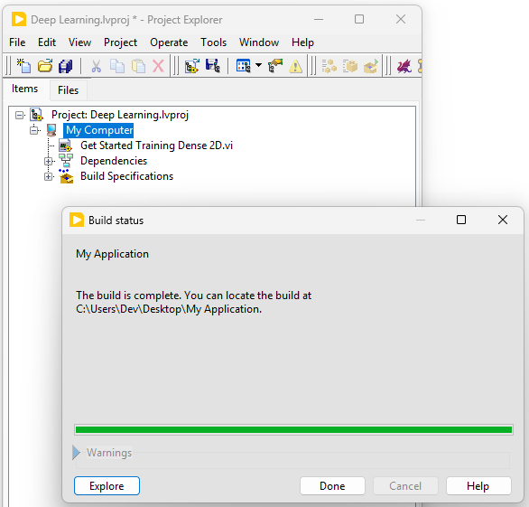

# 🚀 Building Executables from Graiphic Toolkits

This page explains how to build and deploy **LabVIEW executables** using Graiphic toolkits with the **SOTA Application Builder**.

---

## 🧩 How to build an executable?

1. **Download and open SOTA.**  
   In the menu, select **Addon**, then click on **Tools** and choose the **Builder** tool.  
   Download the version compatible with your LabVIEW installation.

   

---

2. **Create your executable**  
   In the *Additional Exclusions* tab, **uncheck**:
   - “Remove unused polymorphic VI instances”  
   - “Remove unused members of project libraries”  
   - “Disconnect unused inline subVIs”

   

---

3. **Open the Builder in LabVIEW**  
   Once your project is configured, open the **LabVIEW menu**, click on **Tools → Graiphic → Builder → Launcher**.

   

---

4. **Select your project and executable**  
   Run the VI, click on **Project Path**, select your project, then choose the executable you want to build and click **Apply**.

   

---

5. **Select the toolkits used in your project**  
   On the next page, select the toolkits installed on your computer that are required for the executable, then click **Build**.

   

---

6. **Wait for the build to complete**  
   Once the process finishes, your **LabVIEW executable** is ready. Click **Done**.

   

---

### ✅ Summary

- SOTA simplifies LabVIEW executable deployment.  
- The builder automatically includes all Graiphic dependencies.  
- Compatible with all **Accelerator**, **Deep Learning**, **GenAI**, **CUDA**, and **Computer Vision** toolkits.

---

**Tags:** Deployment · LabVIEW · Graiphic · Executable · SOTA  
© 2025 Graiphic — Licensed under CC BY 4.0
